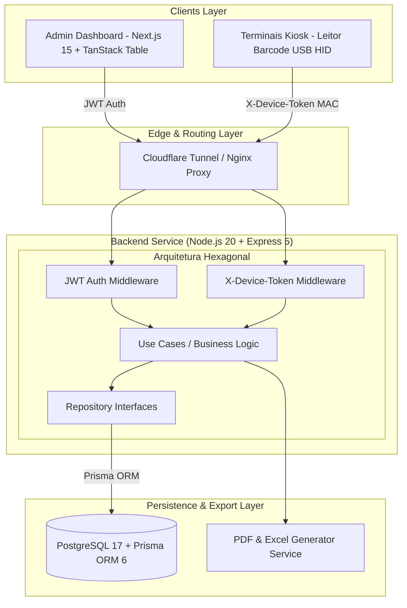

# 🍱 BookingMenu — Corporate Lunch Reservation & Kiosk Check-In Platform

> **📌 Showcase / Case Study Técnico (White-Label Product)**  
> Este repositório é uma demonstração de arquitetura e estudo de caso do **BookingMenu**, uma plataforma corporativa proprietária desenvolvida e aplicada em produção para a **CRAVIL (Cooperativa Regional Agropecuária Vale do Itajaí)**. O código-fonte de regras de negócio é confidencial, mas este documento detalha a engenharia do sistema, arquitetura e stack utilizada em produção.

---

<p align="center">
  
  
  
  
  
  
  
  
</p>

---

## 🎯 Sobre o Projeto & Impacto de Negócio

O **BookingMenu** foi projetado para automatizar e centralizar a gestão de refeições corporativas da cooperativa, atendendo centenas de colaboradores distribuídos em refeitórios operacionais.

### 💡 Problemas Resolvidos:
* **Previsibilidade & Redução de Desperdício:** Planejamento semanal de cardápios com reservas antecipadas por parte dos colaboradores (substituições de proteína e cardápios flexíveis).
* **Automated Kiosk Check-In:** Confirmação de presença em tempo real nos refeitórios via terminais dedicados com leitor de código de barras USB HID e validação física de dispositivos (`X-Device-Token` via MAC Address).
* **Gestão de Auditoria e Relatórios:** Acompanhamento de presença, relatórios operacionais com exportação para PDF e Excel e auditoria de ações administrativas.

---

## 📸 Demonstração Visual (UI / UX)

| Painel Admin / Gestão de Check-in | Terminal Kiosk (Leitor Barcode) |
| :---: | :---: |
|  |  |

---

## 🏗️ Arquitetura de Software & Diagrama do Sistema

A API foi projetada sob os princípios da **Arquitetura Hexagonal Modular (Ports & Adapters)**, permitindo baixo acoplamento entre as regras de domínio de refeições, os métodos de entrada (Dashboard Web REST e Kiosks físicos via Device Token) e os adaptadores de infraestrutura (PostgreSQL 17, Prisma ORM, TanStack Query).


## 🛠️ Tech Stack Completa

### Frontend Ecosystem
- **Core:** Next.js 15.4 (App Router), React 19, TypeScript 5.8
- **Styling & UI:** Tailwind CSS v4, shadcn/ui, Radix UI, sonner (Toasts)
- **State Management & Data Fetching:** TanStack Query v5, TanStack Table v8
- **Form & Validation:** React Hook Form v7, Zod v4, `@hookform/resolvers`
- **Auth & Sessions:** Better Auth v1.2
- **Charts & Export:** Recharts, `@react-pdf/renderer`, XLSX, FileSaver
- **Testing:** Vitest + React Testing Library

### Backend & Infrastructure
- **Runtime & Framework:** Node.js 20+, Express 5.1, TypeScript 5.8
- **Database & ORM:** PostgreSQL 17, Prisma ORM 6.17
- **Validation & Auth:** Zod v4, JWT (jsonwebtoken), Device Authentication Middleware
- **Containerization & Proxy:** Docker Compose (4 containers em prod), Nginx Proxy
- **Edge Tunneling:** Cloudflare Tunnel
- **Observability & Docs:** Swagger UI (OpenAPI), Winston Logging
- **Testing:** Vitest 3.2 + Supertest (Suíte de testes unitários e de integração)

---

## ⚡ Destaques da Engenharia & Decisões Técnicas

1. **Hardware & Terminal Kiosk (USB HID + MAC Address Auth)**  
   Implementação de uma página Kiosk em tela cheia otimizada para terminais Linux (Debian 12). Suporta entrada de dados por leitores de código de barras USB HID e teclado numérico. A autenticação do dispositivo é feita através de um cabeçalho customizado `X-Device-Token` validando o MAC address do hardware pré-cadastrado no banco de dados.

2. **Importação em Massa via Excel com Relatório de Erros Por Linha**  
   Desenvolvimento de motor de importação (`POST /users/import`) capaz de processar arquivos `.xlsx` grandes, realizando validação rigorosa linha por linha (CPF, matrícula, duplicidades) e retornando um relatório detalhado (`ImportReport`) com indicação das linhas com falha sem interromper o fluxo total.

3. **Arquitetura de Relatorios Operacionais e Auditoria de Check-In**  
   Painel com tabelas paginadas do TanStack Table, suporte a ordenação, busca multicritério (CPF, Matrícula, Nome) e exportação em tempo real para PDF estruturado e planilhas Excel. Inclui histórico de audit log reversível para alterações de status de check-in.

---

## 📂 Estrutura de Pastas do Projeto Original

```text
booking-menu/
├── app/
│   ├── backend/                     # API Express (Arquitetura Hexagonal)
│   │   ├── src/
│   │   │   ├── app/modules/         # Módulos (auth, device, lunch-reservation)
│   │   │   └── infrastructure/      # Adaptadores (HTTP, Database, Middleware)
│   │   └── prisma/                  # Schema PostgreSQL e Migrações
│   ├── frontend/                    # App Next.js 15 (App Router)
│   │   └── src/
│   │       ├── app/                 # Routes: (auth), (dashboard), (kiosk)
│   │       ├── _components/         # UI Components & Design System
│   │       └── _hooks/              # Custom TanStack Queries & Mutations
│   └── docker-compose.yml           # Orquestração (Postgres + Backend + Frontend + Nginx)
└── scripts/                         # Automações de Deploy e Cloudflare Tunnel
```

## 👨‍💻 Autor & Engenharia de Software

**Enderson Millan** — *Software Engineer / Full Stack Developer*

- 🌐 **Website / Portfólio:** [endersonmillan.com](https://www.endersonmillan.com/)
- 💼 **LinkedIn:** [linkedin.com/in/enderson-millan](https://www.linkedin.com/in/enderson-millan)
- ✉️ **E-mail:** [millanendersondev@gmail.com](mailto:millanendersondev@gmail.com)
- 📺 **YouTube:** [@millanendersondev](https://www.youtube.com/@millanendersondev)
